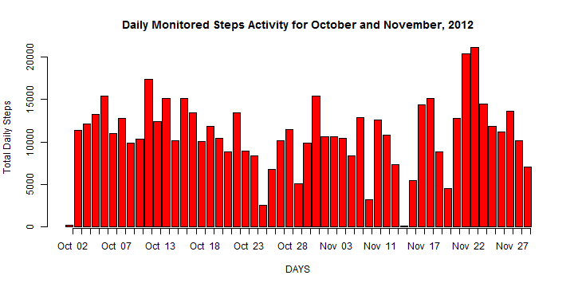
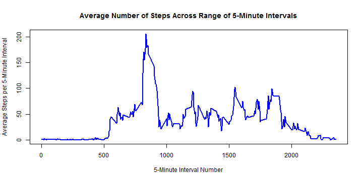
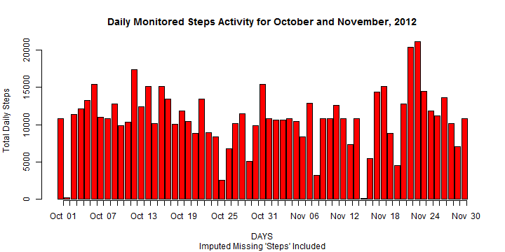
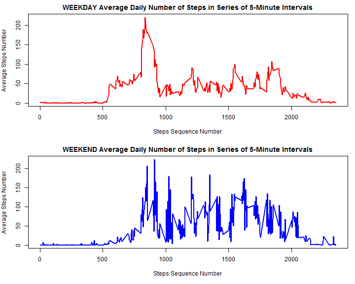

Analysis of Data from Personal Activity Monitoring Device
========================================================

This is a report of the analysis of data from a personal activity monitorng device taken from a single anonymous person from October to November 2012.  The activity data consists of the recording of the number of steps taken in five minute intervals.

First the data was downloaded from the web from the Coursera website (https://d396qusza40orc.cloudfront.net/repdata%2Fdata%2Factivity.zip) on 13 August 2014.

The variables included in this dataset are:

steps: Number of steps taking in a 5-minute interval (missing values are coded as NA)

date: The date on which the measurement was taken in YYYY-MM-DD format

interval: Identifier for the 5-minute interval in which measurement was taken

The dataset is stored in a comma-separated-value (CSV) file and there are a total of 17,568 observations in this dataset.

## Reading the Data into R


```r
setwd("C:/Users/Peter/Documents/Data Scientist Toolbox/Research Presentation/Project 1")
activity <- read.csv("activity.csv")
```

## Summary of Data in Dataframe

```r
summary(activity)
```

```
##      steps               date          interval   
##  Min.   :  0.0   2012-10-01:  288   Min.   :   0  
##  1st Qu.:  0.0   2012-10-02:  288   1st Qu.: 589  
##  Median :  0.0   2012-10-03:  288   Median :1178  
##  Mean   : 37.4   2012-10-04:  288   Mean   :1178  
##  3rd Qu.: 12.0   2012-10-05:  288   3rd Qu.:1766  
##  Max.   :806.0   2012-10-06:  288   Max.   :2355  
##  NA's   :2304    (Other)   :15840
```
## Organising the Data and Removing Missing Values

There are a number of missing values (NAs) in the "steps" column vector of the dataframe.  These were removed before proceding with the analysis.

```r
actstep <-na.omit(activity) # This creates the dataframe with NAs removed
```
## Total Number of Steps Taken Per Day

The 'ddply' function from the 'plyr' package is used throughout this analysis to process the data in dataframes to get the needed variable vectors for further analysis.  It is assumed the 'plyr' package as been previously downloaded from CRAN.

The first data set is the total number of steps taken each day.

```r
library("plyr")
stepsday <- ddply(actstep, .(date), summarise, TotSteps=sum(steps))
```

### Histogram of Total Number of Steps Taken Each Day

Using data in 'stepsday' dataframe, a histogram is plotted of the total number of steps taken each day.


```r
with(stepsday, {
    barplot(TotSteps, col="red", ylab="Total Daily Steps",
    xlab= "DAYS", main= "Daily Monitored Steps Activity for October and November, 2012",
    xaxt='n', width=0.835
    )
    axis(side=1, at=1:length(date), labels=strftime(date, format="%b  %d"), cex.axis=1,lwd.ticks=1) 
    })
```

 


### Mean and Median of Total Number of Steps Taken Each Day


```r
stepsmean <- mean(stepsday$TotSteps[!is.na(stepsday$TotSteps)])
stepsmedian <- median(stepsday$TotSteps[!is.na(stepsday$TotSteps)])
```
The Mean Total Steps Taken per day: **1.0766 &times; 10<sup>4</sup>**     
The Median Total Steps Taken per day:**10765**      


## Average Daily Activity Pattern

To analyse the activity over each 5-minute record period the data in the 'actstep' data frame is processed with 'ddply' to get the average number of steps for each period.


```r
stepint <- ddply(actstep, .(interval), summarise, msteps=mean(steps))
```

### Time Series Plot of Average Number of Steps Taken
This next graph plots the 5-minute intervals (x-axis) and the average number of steps taken, averaged over all days (y-axis).


```r
with(stepint, 
  plot(interval, msteps, type="l", col="blue", lwd=2,
  xlab= "5-Minute Interval Number", ylab = "Average Steps per 5-Minute Interval",
  main = "Average Number of Steps Across Range of 5-Minute Intervals")
  )
```

 


### The Five Minute Time Interval with the Most Steps

The maximum average number of steps and the associated five minute interval  when averaged across all days in the dataset were calculated.


```r
stepsmax <- max(stepint$msteps)
intmax <- stepint$interval[stepint$msteps==stepsmax]
```
Maximum average number of steps in any 5-minute of interval: **206.1698**      
5-minute interval with maximum average number of steps: **835**     

# Imputing Missing values in Activity Dataset
There are a number of missing values(NAs) in the 'steps' data vector of the initial dataset.

## Total number of Rows with Missing Values


```r
miss_steps <- sum(is.na(activity$steps)==TRUE)
miss_int <- sum(is.na(activity$interval) == TRUE)
miss_date <- sum(is.na(activity$date)==TRUE)
```
The number of rows with missing 'steps' values: **2304**    
The number of rows with missing ' interval' values :**0**    
The number of rows with missing 'date' values: **0**     

## Imputing Missing "steps' Values in Initial Dataset from Averages Across '5- Minute Intervals'
The approach to imputing missing 'steps' values was to calculate the mean values across all intervals and then to use those values to replace the missing 'steps' for each interval.  This approach was chosen because some days had missing values across all intervals for that day.

### Derived Dataset with Imputed Missing Values

```r
stepmiss1 <- ddply(actstep, .(interval), summarise, meansteps=mean(steps))
missactivity1 <- activity
missactivity1$steps[is.na(missactivity1$steps) & 
  missactivity1$interval==stepmiss1$interval] <- 
  stepmiss1$meansteps
head(missactivity1,10)
```

```
##      steps       date interval
## 1  1.71698 2012-10-01        0
## 2  0.33962 2012-10-01        5
## 3  0.13208 2012-10-01       10
## 4  0.15094 2012-10-01       15
## 5  0.07547 2012-10-01       20
## 6  2.09434 2012-10-01       25
## 7  0.52830 2012-10-01       30
## 8  0.86792 2012-10-01       35
## 9  0.00000 2012-10-01       40
## 10 1.47170 2012-10-01       45
```

```r
summary(missactivity1)
```

```
##      steps               date          interval   
##  Min.   :  0.0   2012-10-01:  288   Min.   :   0  
##  1st Qu.:  0.0   2012-10-02:  288   1st Qu.: 589  
##  Median :  0.0   2012-10-03:  288   Median :1178  
##  Mean   : 37.4   2012-10-04:  288   Mean   :1178  
##  3rd Qu.: 27.0   2012-10-05:  288   3rd Qu.:1766  
##  Max.   :806.0   2012-10-06:  288   Max.   :2355  
##                  (Other)   :15840
```

## Recalculation of Data of Total Daily Steps from Derived Data
The bar graph of daily steps across all 5-minute intervals was recalculated with imputed values for missing 'steps' values included.  

In addition, the average and median daily total steps was also recalcuated with imputed missing values included.

### Bar Graph with Imputed Missing Values Included


```r
stepday1 <- ddply(missactivity1, .(date), summarise, stepstot = sum(steps))
with(stepday1, {
  barplot(stepstot, col="red", ylab="Total Daily Steps",
          xlab= "DAYS", main= "Daily Monitored Steps Activity for October and November, 2012",
          xaxt='n', width=0.835, sub = "Imputed Missing 'Steps' Included"
  )
  axis(side=1, at=1:length(date), labels=strftime(date, format="%b  %d"), cex.axis=1,lwd.ticks=1)
})
```

 

### Recalculation of Mean and Median of Total Daily Steps from Derived Data


```r
miss_mean1 <- mean(stepday1$stepstot)
miss_median1 <- median(stepday1$stepstot)
```

Recalculated Mean Total Daily Steps: **1.0766 &times; 10<sup>4</sup>**   
Recalculated Median Total Daily Steps: **1.0766 &times; 10<sup>4</sup>**    

# Differences in Activity Patterns Between Weekdays and Weekends

## Creating Factor Variable to Separate Weekday and Weekend Steps Activity


```r
missactivity2 <- missactivity1
missactivity2$date <- as.Date(missactivity2$date)
missactivity2$day <- ifelse(weekdays(missactivity2$date)!=c("Saturday","Sunday"),"weekday","weekend")
step_panel <- ddply(missactivity2, .(day, interval), summarise, meansteps=mean(steps))
head(step_panel,5)
```

```
##       day interval meansteps
## 1 weekday        0   1.94375
## 2 weekday        5   0.38448
## 3 weekday       10   0.14952
## 4 weekday       15   0.17088
## 5 weekday       20   0.08544
```

```r
tail(step_panel,5)
```

```
##         day interval meansteps
## 572 weekend     2335   22.5873
## 573 weekend     2340    0.4127
## 574 weekend     2345    3.3302
## 575 weekend     2350    0.0283
## 576 weekend     2355    0.1344
```

## Time Series Plot Comparing 'Steps' Activity Between Weekdays and Weekends
The plots comparing weekday and weekend step activity show that although in both periods most step activity occurred step 500 and step 2000 5-minute periods, there was more step activity in these middle periods on the weekends.


```r
mat <- matrix(c(1,2),2)
par(mar=c(5,4,2,1))
layout(mat,2,1)
with(step_panel[step_panel$day=="weekday",], {
  plot(interval, meansteps, type='l', col="red", lwd=2,
       main="WEEKDAY Average Daily Number of Steps in Series of 5-Minute Intervals",
       xlab="Steps Sequence Number", ylab= "Average Steps Number" )
})
with(step_panel[step_panel$day=="weekend",],{
  plot(interval, meansteps,type="l", col="blue", lwd=2,
       main="WEEKEND Average Daily Number of Steps in Series of 5-Minute Intervals",
       xlab = "Steps Sequence Number",  ylab= "Average Steps Number"  )
})
```

 
